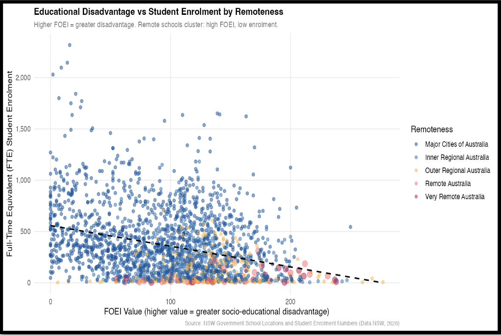
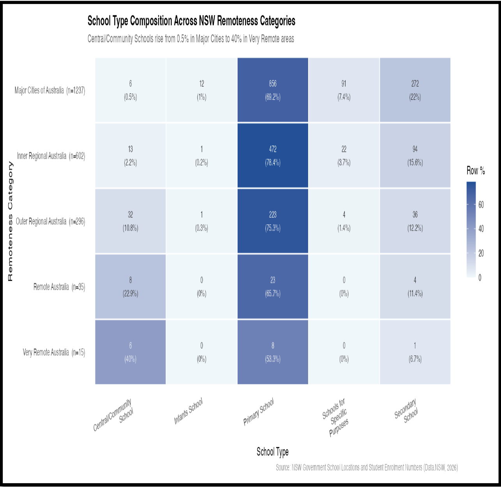
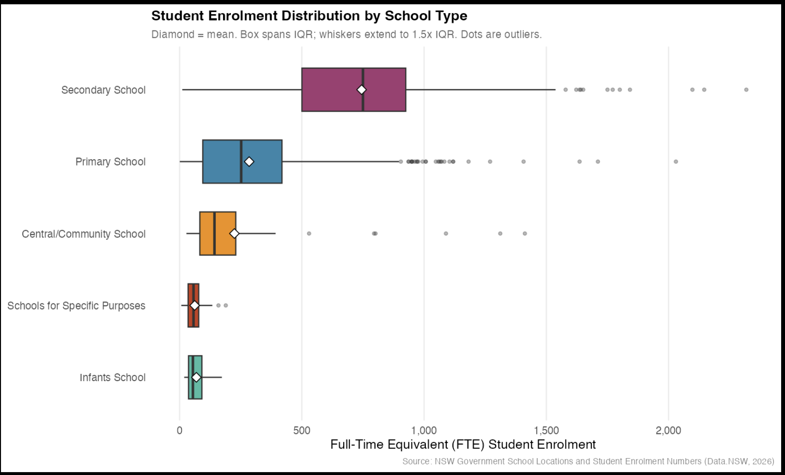

# nsw-schools-analysis
An R-based analysis of 2,210 NSW government schools showing how school size, structure, and socio-educational disadvantage shift with geographic remoteness - built with ggplot2, dplyr, and Leaflet.

# NSW Government Schools: Enrolment, Geography & Educational Disadvantage

An analysis of **2,210 NSW government schools** examining how school size, structure, and socio-educational disadvantage shift with geographic remoteness. Built in R using `ggplot2`, `dplyr`, and `leaflet`.

**Central finding:** school size and socio-educational disadvantage both worsen with geographic remoteness - a pattern with direct implications for how education resources are allocated across the state.

---

## Tools & Skills

`R` · `ggplot2` · `dplyr` · `leaflet` · `scales` · data cleaning · spatial visualisation · statistical communication · ethical data handling

---

## Dataset

NSW Government School Locations and Student Enrolment Numbers ([Data.NSW](https://data.nsw.gov.au)) — 2,210 government schools with GPS coordinates, school type, full-time-equivalent (FTE) enrolment, ASGS remoteness classifications, and socio-educational indices (ICSEA, FOEI).

---

## Data Cleaning

The raw file needed systematic cleaning before any analysis:

- **Privacy suppression handled correctly.** The Department's `"np"` code (used when a student cohort is five or fewer) was converted to `NA` rather than treated as zero — preserving both analytical accuracy and student anonymity.
- **Type coercion.** Columns misread as text (because `"np"` was mixed with numbers) were converted back to numeric.
- **Floating-point cleanup.** FTE enrolment values carrying precision artefacts (e.g. `2097.3999…`) were rounded to one decimal place.
- **Suburb standardisation.** Inconsistent capitalisation was normalised, collapsing 1,491 raw suburb strings to 1,327 true unique values.
- **Ordered factors.** Remoteness was converted to an ordered factor so every chart sorts logically (urban → very remote) rather than alphabetically.
- **Validated up front.** Confirmed zero duplicate school codes and no stray whitespace on the raw file, so cleaning effort went only where needed.

Two working datasets were produced: one retaining all schools for geographic and count-based charts, and one restricted to valid enrolments for distribution analysis.

---

## Visualisations

| # | Chart | What it shows |
|---|-------|---------------|
| 1 | Histogram | Enrolment is strongly right-skewed (median 276 vs mean 356 FTE); over 53% of schools enrol 300 or fewer students |
| 2 | Interactive Leaflet map | 56.5% of schools cluster in Major Cities along the eastern seaboard; remote schools scatter across vast inland distances |
| 3 | Boxplot | Secondary schools have the highest median enrolment (750 FTE); primary schools span the widest range |
| 4 | Heatmap | Central/Community Schools rise from 0.5% of schools in Major Cities to 40% in Very Remote areas |
| 5 | Scatter plot | Higher disadvantage (FOEI) is associated with lower enrolment; remote schools cluster at high-FOEI, low-enrolment |

### Educational Disadvantage vs Enrolment

### School Type Composition by Remoteness

### Enrolment Distribution by School Type

---

## Key Findings

Across all five visualisations, geographic remoteness consistently predicts smaller schools, structurally different school models, and greater socio-educational disadvantage. Three drivers explain the pattern:

1. **Population distribution** — NSW's population concentrates along the eastern coastal corridor, so demand for large schools exists mainly in metropolitan and inner-regional areas.
2. **Infrastructure economics** — running separate primary and secondary campuses in sparsely populated areas is unviable, driving the shift toward combined Central/Community Schools in remote zones.
3. **Socio-economic geography** — remote communities disproportionately include lower-income households, producing the elevated FOEI values seen in the scatter plot.

The starkest illustration: a 2,317-student gap between the largest school (The Ponds High School, 2,318 FTE) and the smallest (Tulloona Public School, 1 FTE) — both within the same public funding framework.

---

## Ethical Approach

- **Privacy** — suppressed values excluded rather than imputed, protecting students in small cohorts from re-identification.
- **Accuracy** — outliers retained and all axes anchored at zero to avoid visual distortion of inequality.
- **Transparency** — fully commented, reproducible R code; small-sample figures (e.g. the 40% based on only 15 Very Remote schools) explicitly flagged as volatile.

---

## Repository Contents

nsw-schools-analysis/

├── nsw_schools_analysis.R     # full analysis pipeline

├── report.pdf                 # written report with all five figures

├── plot1_histogram_enrolment.png

├── plot2_map_screenshot.png

├── plot3_boxplot_schooltype.png

├── plot4_heatmap_type_remoteness.png

├── plot5_scatter_foei_enrolment.png

└── README.md
---

*Analysis by Yajur Bhardwaj. Data source: NSW Department of Education via Data.NSW.*
